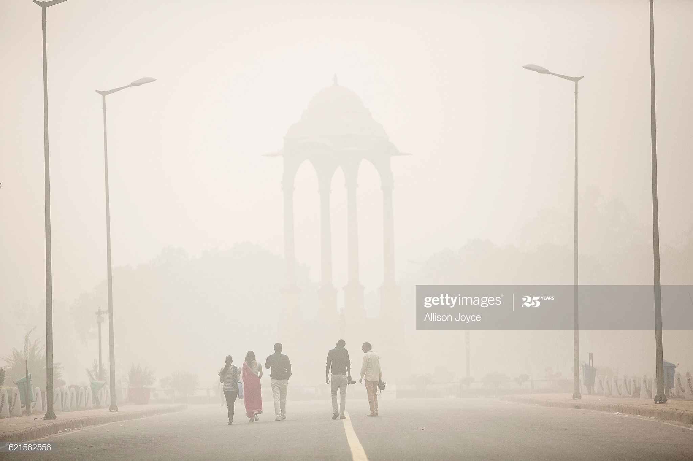

# Data-Analysis-and-Visualization-of-India-Air-Quality

The purpose of this project is to analyze and visualize the data of Air Quality in India.

India has made it to the headlines when it comes to air pollution. The growing air pollution in the country has been one of the serious concerns for both the government and the citizens.Here perform Exploratort data analysis and Visualization on dataset.

##Data
